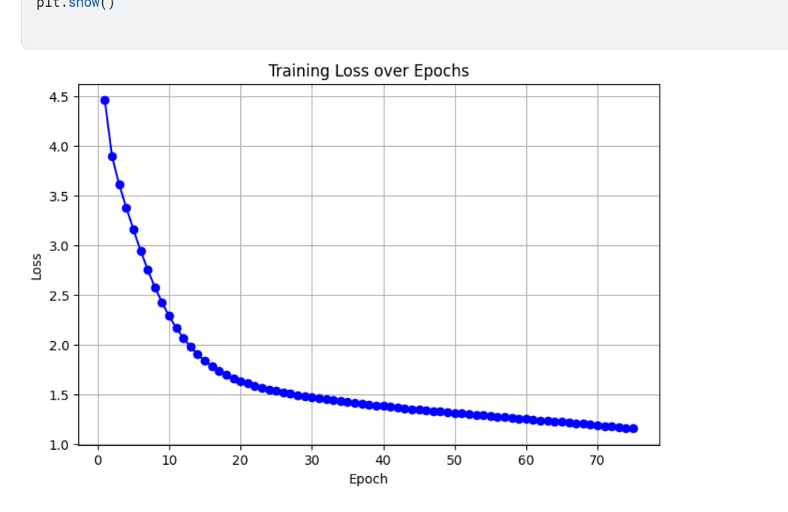

  # 🖼️ Image Captioning Generator

  An end-to-end deep learning project that generates **descriptive, human-like captions for images** using an **encoder–decoder architecture with attention mechanisms**.

  ---

  ## 📌 Project Overview

  This project implements an **Image Captioning System** capable of understanding visual content and generating meaningful textual descriptions. It combines computer vision and natural language processing techniques to bridge the gap between images and language.

  ### Core Components
  - **Encoder (CNN):** Extracts high-level visual features from images
  - **Decoder (RNN / LSTM):** Generates captions word-by-word
  - **Attention Mechanism:** Focuses on relevant regions of the image while generating each word

  The project supports **quantitative evaluation** using BLEU scores and **qualitative analysis** through attention heatmap visualizations.

  ---

  ## ✨ Features

  - End-to-end trainable image captioning model
  - Caption generation for unseen images
  - Attention visualization for interpretability
  - Evaluation using BLEU-1 to BLEU-4 metrics
  - Modular and extensible codebase for experimentation

  ---

  ## 📊 Results & Visualizations

  ### 📈 Training Convergence
  The following plot illustrated the reduction in Cross-Entropy Loss over the training epochs. The convergence of the validation loss indicates the model's ability to generalize to unseen images.

  <p align="center">
    
  </p>

  ### 🖼️ Model Predictions
  Below are five qualitative results showing the captions generated by the model on the test dataset.

  | Sample 1 | Sample 2 | Sample 3 |
  | :---: | :---: | :---: |
  |  |  |  |
  | **"a and propeller plane on tarmac runway mountains"** | **"a woman holds a dish with food in it"** | **"a and motorcycle on sidewalk parked"** |

  <br>

  | Sample 4 | Sample 5 |
  | :---: | :---: |
  |  |  |
  | **"four urinals in a public restroom with window"** | **"a car street a and bus"** |

  ---

  ### 🔍 Attention Heatmap Visualization
  The attention mechanism allows the model to focus on specific image regions. In the heatmaps below, the brighter areas indicate where the model placed its "focus" while generating the corresponding word.

  <p align="center">
    
    
    <br>
    <i>Visualizing spatial focus during word generation</i>
  </p>

  ---

  ## 🧱 Project Structure

  ```text
  image-captioning/
  │
  ├── README.md
  ├── requirements.txt
  ├── .gitignore
  │
  ├── data/
  │   ├── images/            # Raw image dataset
  │   ├── captions/          # Caption files (JSON / CSV / TXT)
  │   └── processed/         # Preprocessed data & tokenized captions
  │
  ├── notebooks/             # Jupyter notebooks for exploration & analysis
  │
  ├── src/                   # Core source code
  │   ├── dataset.py         # Dataset loading & preprocessing
  │   ├── model.py           # Encoder, Decoder & Attention models
  │   ├── train.py           # Training loop
  │   ├── evaluate.py        # Caption generation & evaluation
  │   ├── utils.py           # Helper utilities
  │   └── visualize.py       # Attention visualization
  │
  ├── checkpoints/           # Saved model weights
  └── outputs/               # Generated captions, plots & reports
  ```
  ---
  ## 🛠️ Tech Stack

  | Category | Technologies |
  |--------|--------------|
  | 🎨 **Vision Encoder** | 🧠 CNN (ResNet / Custom CNN) |
  | 📝 **Language Decoder** | 🔁 RNN / 🧠 LSTM |
  | 🎯 **Attention Mechanism** | 🎯 Soft Attention |
  | 🧪 **Frameworks** | 🐍 Python &nbsp;•&nbsp; 🔥 PyTorch / 🧠 TensorFlow |
  | 📊 **Evaluation Metrics** | 📏 BLEU (1–4) |
  | 🧰 **Tools & Utilities** | 📓 Jupyter &nbsp;•&nbsp; 🧑‍💻 Git &nbsp;•&nbsp; 🌍 GitHub &nbsp;•&nbsp; 🧪 Virtual Environment (venv) |

  ---

  ## 🛠️ Installation

  ### 1️⃣ Clone the repository
  ```bash
  git clone https://github.com/your-username/image-captioning.git
  cd image-captioning
  ```
  ### 2️⃣ Create and activate a virtual environment
  ```
  python -m venv venv
  ```
  - Linux / macOS
  ```
  source venv/bin/activate
  ```
  - Windows
  ```
  venv\Scripts\activate
  ```

  --- 

  ### 3️⃣ Install Dependencies
  ```
  pip install -r requirements.txt
  ```

  ---

  ## 🚀 Usage

  ### 🔹 Train the Model
  ```bash
  python src/train.py --data_path data/ --epochs 20 --batch_size 32
  ```
  ### 🔹 Generate Caption for a Single Image
  ```
  python src/evaluate.py \
    --image_path data/images/sample.jpg \
    --checkpoint checkpoints/best_model.pth
  ```
  ### 🔹 Visualize Attention Maps 
  ```
  python src/visualize.py \
    --image_path data/images/sample.jpg \
    --caption "a man riding a snowboard" \
    --alphas alphas.npy
  ```

  ---
  ## 📊 Evaluation Metrics

  The model is evaluated using standard image captioning metrics to measure caption quality and accuracy.

  - **BLEU-1 to BLEU-4** – Measures n-gram overlap between generated and reference captions.

  ### Optional Metrics
  - **METEOR**
  - **ROUGE**
  - **CIDEr**

  These metrics help assess the accuracy and fluency of the generated captions.

  ---

  ## 📈 Future Enhancements
  - Transformer-based captioning models
  - Beam search decoding
  - Pretrained vision encoders (ResNet, EfficientNet)
  - CIDEr and SPICE metric integration
  - Web-based demo for real-time caption generation

  ---

  ## 📚 Learning Outcomes
  - Encoder–decoder architectures
  - Attention mechanisms in deep learning
  - CNN-based feature extraction
  - Sequence modeling with RNNs / LSTMs
  - NLP evaluation metrics
  - Model interpretability using attention visualization

  ---

  ## 👤 Author
  - Dhruv Lad
