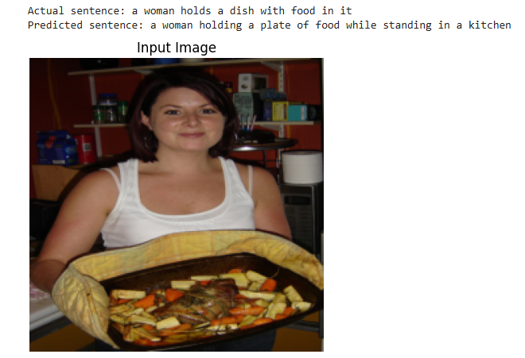
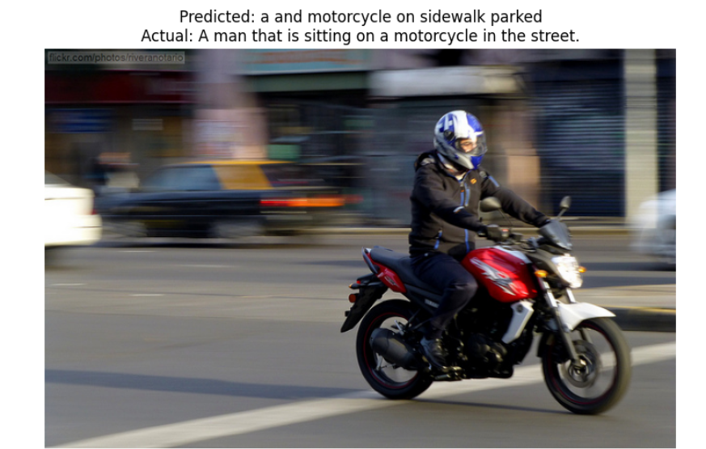
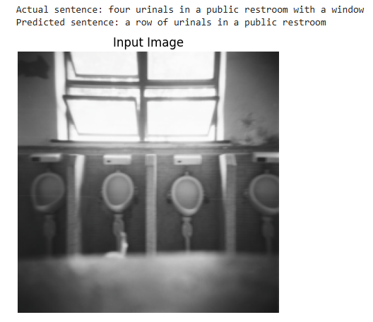
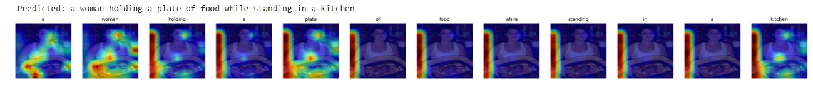
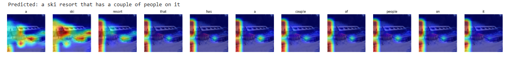
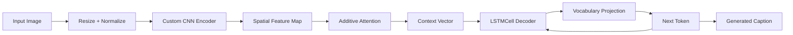

# Image Captioning Generator

This project is a PyTorch image captioning system that generates natural-language captions from input images using a custom CNN encoder, additive attention, and an LSTM-based decoder. The implementation is intentionally compact and research-oriented: it reads COCO-style caption annotations, builds a vocabulary from the training captions, trains an encoder-decoder model with teacher forcing, and can generate captions and attention maps for individual images.

The repository is structured as a small educational / research codebase rather than a production web app or packaged framework. The implementation and training flow are defined directly in the Python source files and can be executed from the project root.

## Project overview

The actual model pipeline in this repository is:

Image
→ image preprocessing
→ custom CNN encoder
→ spatial feature embedding
→ additive attention
→ LSTM decoder
→ vocabulary projection
→ generated caption

The architecture is implemented through the modules in the `models/` directory, while dataset loading, vocabulary construction, checkpoint handling, evaluation, and visualization utilities live under `utils/` and `inference/`.

## Highlights

- Custom CNN encoder for spatial feature extraction
- Additive soft attention between encoder features and decoder hidden state
- LSTMCell-based decoder for autoregressive caption generation
- Vocabulary tokenization and numericalization from COCO captions
- Teacher-forcing training with shifted target captions
- Checkpoint saving and loading for trained model weights
- COCO 2017 dataset support with configurable dataset path
- BLEU-based evaluation via NLTK
- Attention-map visualization for generated captions
- CPU-first training/inference with optional CUDA when available

## Example outputs from the project

The repository includes example result images under the `images/` directory. These are useful for understanding the type of output produced by the captioning pipeline: a model-generated caption is compared against the visual content of the image, and the attention maps show which image regions were emphasized while each word was being produced.

### Generated caption examples

<p align="center">
    
    
    
</p>

<p align="center">
    
    
</p>

These outputs show the model producing short, image-grounded descriptions such as identifying a person, vehicle, object, or scene. The model is not designed to generate highly polished captions every time; it is a compact research implementation that favors clear visual grounding over production-level language quality.

### Attention-map examples

<p align="center">
    
    
</p>

The attention maps highlight the spatial regions the model focused on while predicting particular words. In these visualizations, brighter areas indicate stronger attention. This makes the decoder easier to inspect: instead of being a black box, it can be interpreted as choosing the image regions most relevant to a word such as an object, person, or scene element.

## Repository structure

```text
Image_Caption_Generator/
├── README.md
├── requirements.txt
├── .gitignore
├── train.py
├── data/
│   └── MSCOCO.txt
├── images/
│   ├── heatmap_image-2.png
│   ├── heatmap_other.png
│   ├── loss_curve.png
│   ├── new_loss_curve.png
│   ├── output_image1.png
│   ├── output_image2.png
│   ├── output_image3.png
│   ├── output_image4.png
│   └── output_image5.png
├── inference/
│   ├── caption_pred.py
│   ├── metric_eval.py
│   └── visualize_attention.py
├── models/
│   ├── attention.py
│   ├── combined_model.py
│   ├── decoder.py
│   └── encoder.py
├── results/
│   ├── generated_captions.txt
│   └── attention_maps/
│       ├── Screenshot 2025-10-23 014517.png
│       └── Screenshot 2025-10-23 014559.png
└── utils/
    ├── checkpoint.py
    ├── dataset.py
    ├── evaluation.py
    ├── visualization.py
    └── vocab.py
```

## Model architecture

The actual model is a custom encoder-decoder captioning network, not a pretrained backbone and not a transformer.

### Encoder

Implemented in `models/encoder.py`.

The encoder is a 5-stage CNN:

- Input: `(B, 3, H, W)`
- Conv2d(3, 32, kernel_size=3, stride=2, padding=1)
- BatchNorm2d(32)
- ReLU
- Conv2d(32, 64, kernel_size=3, stride=2, padding=1)
- BatchNorm2d(64)
- ReLU
- Conv2d(64, 128, kernel_size=3, stride=2, padding=1)
- BatchNorm2d(128)
- ReLU
- Conv2d(128, 256, kernel_size=3, stride=2, padding=1)
- BatchNorm2d(256)
- ReLU
- Conv2d(256, 512, kernel_size=3, stride=2, padding=1)
- BatchNorm2d(512)
- ReLU
- Dropout(0.3)
- Linear(512, embed_size)

After the CNN stack, the feature map is flattened across spatial dimensions and projected into an embedding space:

- feature shape before flatten: `(B, 512, H', W')`
- after permute and reshape: `(B, num_pixels, 512)`
- after projection: `(B, num_pixels, embed_size)` where `embed_size = 256`

### Attention mechanism

Implemented in `models/attention.py`.

This is additive / soft attention:

- `encoder_att`: linear projection from encoder dimension to attention dimension
- `decoder_att`: linear projection from decoder hidden state to attention dimension
- `tanh(encoder_att + decoder_att)`
- `full_att` produces a scalar attention score per spatial location
- `softmax` across all spatial positions
- weighted context vector: `(encoder_out * alpha).sum(dim=1)`

The attention module returns:

- `context`: `(B, encoder_dim)`
- `alpha`: attention weights of shape `(B, num_pixels, 1)`

### Decoder

Implemented in `models/decoder.py`.

The decoder uses:

- `nn.Embedding(vocab_size, embed_size)`
- `nn.LSTMCell(embed_size + embed_size, hidden_size)`
- `nn.Linear(hidden_size, vocab_size)`
- dropout before the final vocab projection

The decoder receives:

- encoder output: `(B, num_pixels, embed_size)`
- caption tokens: `(B, T)`

During training, the model predicts outputs for `captions[:, :-1]` and compares them to `captions[:, 1:]` using teacher forcing.

### Combined model

Implemented in `models/combined_model.py`.

The model wrapper simply connects:

`EncoderCNN` -> `DecoderWithAttention`

with the forward pass:

```python
encoder_out = self.encoder(images)
outputs = self.decoder(encoder_out, captions)
```

The output shape is `(B, T-1, vocab_size)`.

## Data flow

The training data pipeline in this repository is:

1. Read COCO caption JSON file from the dataset annotations directory.
2. Map each `image_id` to the corresponding image filename.
3. Build a list of `(image_path, caption)` pairs.
4. Tokenize captions using the vocabulary logic.
5. Convert tokens into integer IDs.
6. Add `<SOS>` and `<EOS>` around each caption.
7. Prepare a PyTorch `Dataset` that returns image tensor + caption tensor.
8. Pad captions in a batch with `<PAD>` tokens.
9. Feed the image batch and shifted caption batch into the model.
10. Compute cross-entropy loss against the shifted target captions.

## Training pipeline

The actual training logic lives in `train.py` and uses the following default configuration:

- `--dataset-dir` default: `data/coco2017`
- `--epochs` default: `60`
- `--batch-size` default: `32`
- `--subset-size` default: `60000`
- `--lr` default: `1e-3`
- `--freq-threshold` default: `5`
- `--checkpoint-dir` default: `checkpoints`

The script performs the following steps:

1. Reads the COCO `captions_train2017.json` file.
2. Builds a vocabulary from all training captions.
3. Creates `CocoDataset` instances using the image/caption pairs.
4. Selects a subset of samples using `Subset(dataset, range(subset_size))`.
5. Constructs a `DataLoader` with `collate_fn=partial(collate_fn, vocab=vocab)`.
6. Instantiates the model and optimizer.
7. Trains using `nn.CrossEntropyLoss(ignore_index=vocab.stoi["<PAD>"])`.
8. Saves checkpoints at the configured checkpoint path.

The optimizer is:

```python
torch.optim.Adam(model.parameters(), lr=args.lr)
```

The model runs on:

```python
device = torch.device("cuda" if torch.cuda.is_available() else "cpu")
```

This means the project is written to support CPU execution and optional CUDA execution when available, but the repository does not assume CUDA is present.

## Vocabulary and tokenization

The vocabulary implementation is in `utils/vocab.py`.

Special tokens are defined as:

- `0: "<PAD>"`
- `1: "<SOS>"`
- `2: "<EOS>"`
- `3: "<UNK>"`

The tokenizer lowercases text and extracts words using a regex-based word split:

```python
re.findall(r"\b\w+\b", text)
```

The vocabulary is built by counting tokens across the training captions and keeping words whose frequency is greater than or equal to the configured threshold.

The numericalization step maps each word to its integer ID, falling back to `<UNK>` when a word is not in the vocabulary.

## Data preprocessing

The training pipeline applies the following transforms from `train.py`:

```python
transforms.Resize((224, 224))
transforms.ToTensor()
transforms.Normalize(
    mean=[0.485, 0.456, 0.406],
    std=[0.229, 0.224, 0.225],
)
```

This matches the standard ImageNet-like normalization used for the encoder input. Images are loaded as RGB using Pillow before transformation.

## Dataset assumptions

The repository expects a COCO 2017 dataset root with a structure like:

```text
<dataset_dir>/
├── train2017/
│   ├── 000000000001.jpg
│   ├── 000000000002.jpg
│   └── ...
└── annotations/
    └── captions_train2017.json
```

The README files in the repo document this layout in `data/MSCOCO.txt`.

Important notes:

- The dataset itself is not included in the repository.
- The code expects the COCO data to exist locally.
- There is no automatic download step in the project.
- The training script accepts a dataset directory via `--dataset-dir`.

## Checkpointing

Checkpoint behavior is implemented in `train.py` and `utils/checkpoint.py`.

`save_checkpoint` stores:

- `epoch`
- `model_state_dict`
- `optimizer_state_dict`
- `loss`

The default checkpoint path used by the training script is:

```text
checkpoints/checkpoint_img_caption.pth
```

The checkpoint directory is created automatically if it does not exist.

Loading a checkpoint is done via `utils/checkpoint.py`:

```python
checkpoint = torch.load(path, map_location="cpu")
model.load_state_dict(checkpoint["model_state_dict"])
optimizer.load_state_dict(checkpoint["optimizer_state_dict"])
```

## Inference and caption generation

The caption generation utility is in `utils/visualization.py`.

The function `generate_caption` performs greedy decoding:

- start with `<SOS>`
- encode the image once
- initialize hidden state and cell state to zeros
- at each step:
  - embed the current word
  - compute attention context with current hidden state
  - concatenate embedding and context
  - pass to `LSTMCell`
  - project hidden state to vocabulary logits
  - choose the argmax token
  - stop when `<EOS>` is reached or max length is reached

The function `generate_caption_with_attention` returns both the predicted caption and the attention weights recorded during generation.

## BLEU evaluation

The evaluation utility is implemented in `utils/evaluation.py`.

It computes:

- BLEU-1
- BLEU-4

using `nltk.translate.bleu_score.corpus_bleu`.

This is the actual evaluation module implemented by the repository. The script `inference/metric_eval.py` wraps that functionality with a CLI that expects a local COCO dataset and a checkpoint.

## Attention visualization

The attention visualization logic is in `utils/visualization.py`.

`visualize_attention(image, caption, alphas)` does the following:

1. Converts the image tensor back to a NumPy image.
2. Reverses the normalization to show the original image colors approximately.
3. Reshapes each attention map to a 2D spatial grid.
4. Resizes it to the original image dimensions.
5. Plots the image and attention overlay for each generated word.

This provides a qualitative map of the attention locations used during caption generation.

## Inference scripts

The repository includes several execution-oriented scripts:

### `train.py`

Main training entry point.

Usage:

```bash
python train.py --dataset-dir "D:\path\to\coco2017" --epochs 60 --batch-size 32 --subset-size 60000 --checkpoint-dir checkpoints
```

### `inference/caption_pred.py`

Generates a caption for a single image from a checkpoint.

Usage:

```bash
python inference\caption_pred.py --image "D:\path\to\image.jpg" --checkpoint "checkpoints\checkpoint_img_caption.pth"
```

### `inference/metric_eval.py`

Evaluates a trained model with BLEU on a subset of the COCO dataset.

Usage:

```bash
python inference\metric_eval.py --dataset-dir "D:\path\to\coco2017" --checkpoint "checkpoints\checkpoint_img_caption.pth" --batch-size 32 --subset-size 1000
```

### `inference/visualize_attention.py`

Generates a caption for an input image and overlays attention maps during decoding.

Usage:

```bash
python inference\visualize_attention.py --image "D:\path\to\image.jpg" --checkpoint "checkpoints\checkpoint_img_caption.pth"
```

## Dependencies

The project relies on the packages listed in `requirements.txt`:

- `numpy==1.25.0`
- `matplotlib==3.8.0`
- `Pillow==10.1.0`
- `tqdm==4.66.1`
- `torch==2.1.0`
- `torchvision==0.16.0`
- `nltk==3.8.1`

This is the actual dependency set used by the project source files.

## Environment notes

The project is designed to run with Python 3.11 and the installed PyTorch/TorchVision versions in the working environment. CUDA is optional and selected automatically when available. The repository does not ship a custom training runtime or a Dockerfile.

## Quick start

1. Create a virtual environment:

```bash
python -m venv .venv
```

2. Activate it on Windows PowerShell:

```powershell
.\.venv\Scripts\Activate.ps1
```

3. Install dependencies:

```bash
python -m pip install --upgrade pip
python -m pip install -r requirements.txt
```

4. Prepare the COCO dataset in a local directory such as:

```text
D:\data\coco2017\
```

5. Train the model:

```bash
python train.py --dataset-dir "D:\data\coco2017" --epochs 60 --batch-size 32 --subset-size 60000 --checkpoint-dir checkpoints
```

6. Generate a caption for an image:

```bash
python inference\caption_pred.py --image "D:\path\to\image.jpg" --checkpoint "checkpoints\checkpoint_img_caption.pth"
```

## Example outputs

The repository includes example result images under `images/` and generated caption artifacts under `results/`. These files are useful for inspecting the project’s output format and the expected visualization style, but they are not substitutes for a trained checkpoint or a local COCO dataset.

## Known project limitations

- The project expects a local COCO dataset and does not include training data in the repository.
- There is no packaged pretrained model checkpoint in the repo.
- There is no web UI, API, or notebook-based demo packaged as a service.
- Training and evaluation are script-based rather than abstracted into a CLI framework.
- The implementation is intentionally minimal and focused on core research functionality rather than production polish.
- The caption generation process is greedy and uses the most probable next token at each step.

## Architecture diagram



## Summary

This repository implements a compact, training-capable image captioning system in PyTorch. It uses a custom CNN encoder, additive soft attention, and an LSTM-based decoder to generate captions from COCO image-caption pairs. The code is designed to be understandable and practical for study, experimentation, and further refinement, rather than for deployment as a commercial-grade product.
